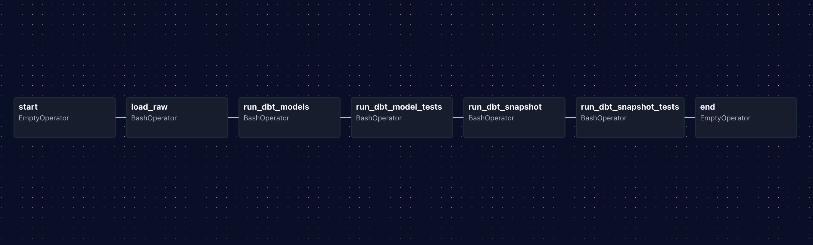

# Airflow

Orchestrates data pipeline workflows via DAGs mounted from this directory into the Airflow
container. The full stack (Airflow + PostgreSQL + Redis) is started via `docker-compose.yaml`.

## Available DAGs

| DAG | Schedule | Description |
|-----|----------|-------------|
| `cdc_pipeline` | `@daily` | CDC ingestion → dbt models → dbt tests → snapshot → snapshot tests |

### DAG graph

### `cdc_pipeline` stages

1. **load_raw** — `python raw.py` ingests JSONL CDC events into `raw.cdc_events` (DuckDB)
2. **run_dbt_models** — builds `staging.stg_cdc_events` and `clean.users`
3. **run_dbt_model_tests** — runs all dbt tests except snapshot tests
4. **run_dbt_snapshot** — builds `snapshots.users_snapshot` (SCD Type 2)
5. **run_dbt_snapshot_tests** — validates snapshot output
6. **end**

Set `TAXFIX_FULL_REFRESH` to any non-empty value in `.env` to trigger a full backfill on
the next DAG run (both the ingestion script and `dbt run` respect this flag).

## How to trigger

1. Start the stack: `cd tools/sh && ./clean_deploy_stack.sh`
2. Open the Airflow UI: `http://localhost:8080`
3. Login with default credentials: `airflow` / `airflow`
4. The DAG starts **paused** — toggle it on, then trigger manually

> **Note:** The DAG is paused on creation (`is_paused_upon_creation=True`) to prevent the
> scheduler from auto-queuing a run at startup. Without this, the scheduler and a manual
> trigger can both start `load_raw` simultaneously, causing a DuckDB write-lock conflict.

## Config location

`modules/airflow/config/airflow.cfg`

The Airflow project directory is mounted at `AIRFLOW_PROJ_DIR=./modules/airflow`
(dags, logs, config, plugins all resolve relative to this directory).
The full repo is mounted at `/opt/airflow/repo` inside the container.
